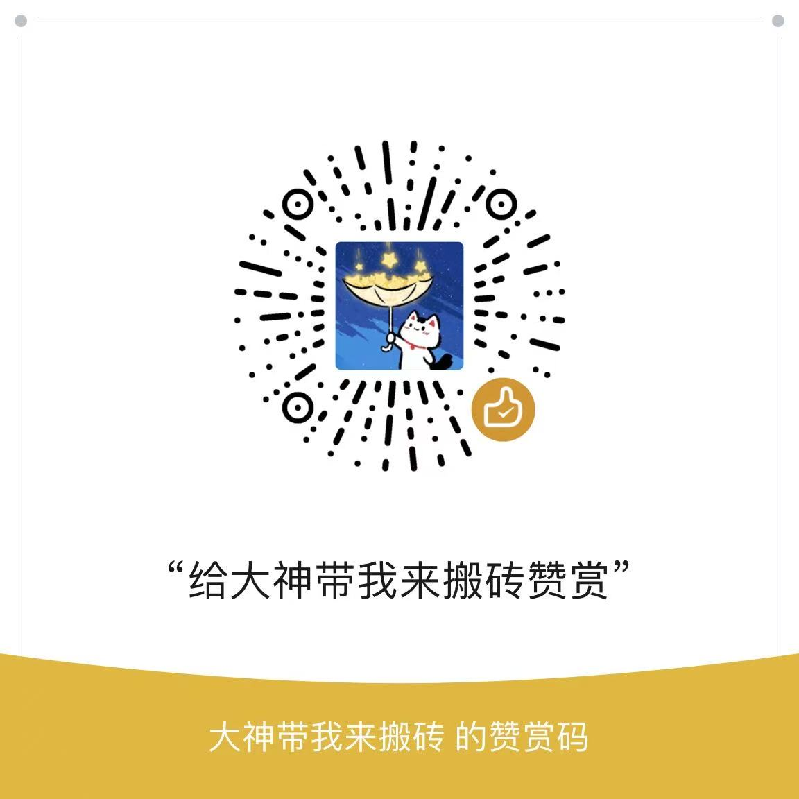

# 微光计划（Lumina Project）

**微光计划** 是一个开源的公益激励项目，我们邀请你分享真实的人生故事。  

任何组织和个人都可以通过打赏支持本项目，所有资金将 **100%用于奖励勇敢讲述的人**。

✨ **打赏说明**：捐赠者可在打赏时附带商业推广，作为善意的“光之回响”。

> 我们相信，每一个微小而真实的叙述，都是一束光。  
> 它可能照亮他人前行的路，也可能成为自己蜕变的起点。

---

🌟 **核心原则——真实**：只奖励真诚的个人故事  

---

**1.0.0：** 东北地区真实收入分享，发布在小红书平台https://xhslink.com/m/5HwDWaO8Zhq
地址在https://github.com/H-repos/Lumina/tree/main/1.0.0

赞赏码

