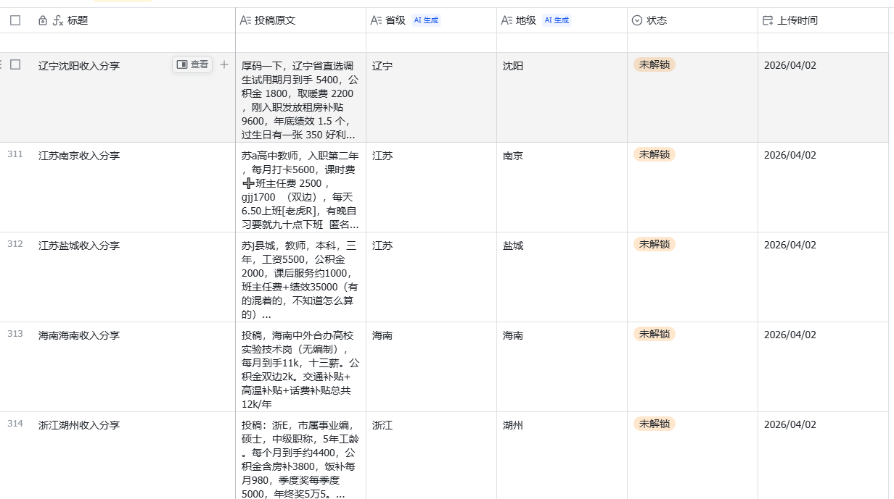

# 微光计划（Lumina Project）

微光计划的目标是建立一个收入数据库，帮助每个人了解各地各行业的收入情况。

当无数微光汇聚，就能照亮一条更清晰的路。

由于GitHub经常打不开，所以资料上传到飞书表格了。

迅雷：https://pan.xunlei.com/s/VOl1pu0eD03GoiPFyloDBFhkA1?pwd=ji44#

UC：https://drive.uc.cn/s/b12767ef7aad4?public=1

---
任何组织和个人都可以通过打赏支持本项目，所有资金将100%用于稿费发放。

✨ **打赏说明**：捐赠者可在打赏时附带商业推广，作为善意的“光之回响”。

赞赏码

